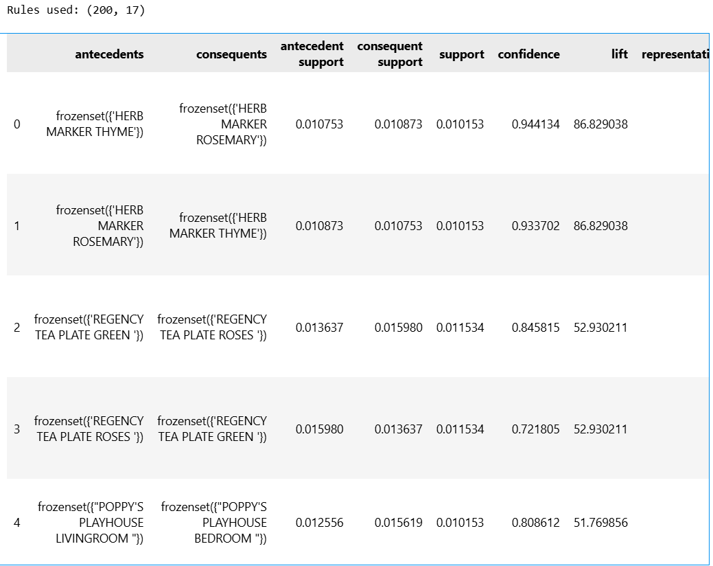
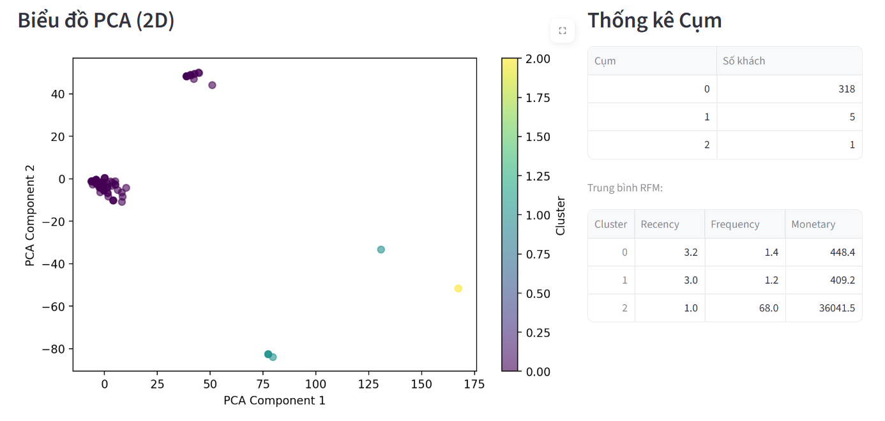
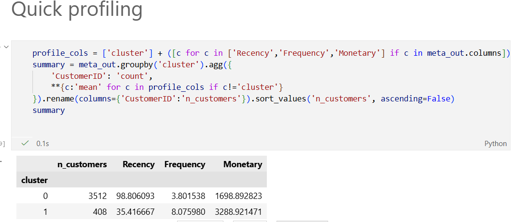

# BÁO CÁO DỰ ÁN: PHÂN CỤM KHÁCH HÀNG (MARKET BASKET ANALYSIS & RFM)

* **Thực hiện bởi:** Nhóm 3
* **Dữ liệu:** Online Retail II (UK Transactions)
* **Mục tiêu:** Xây dựng hệ thống phân khúc khách hàng tự động dựa trên thói quen mua sắm (Luật kết hợp) và giá trị vòng đời (RFM).

---

## MỤC LỤC
1.  [Tổng quan & Khám phá dữ liệu (Rules Mining)](#1-tổng-quan--khám-phá-dữ-liệu-rules-mining)
2.  [Kết quả Mô hình 1: Phân cụm Cơ bản (Baseline)](#2-kết-quả-mô-hình-1-phân-cụm-cơ-bản-baseline)
3.  [Kết quả Mô hình 2: Phân cụm Nâng cao (RFM Integration)](#3-kết-quả-mô-hình-2-phân-cụm-nâng-cao-rfm-integration)
4.  [So sánh & Kết luận](#4-so-sánh--kết-luận-baseline-vs-advanced)
5.  [Insight & Khuyến nghị](#5-insight--khuyến-nghị-dành-cho-nhà-quản-lý)

---

## 1. Tổng quan & Khám phá dữ liệu (Rules Mining)

Trước khi phân nhóm, chúng tôi sử dụng thuật toán **Apriori/FP-Growth** để tìm ra các "luật ngầm" trong giỏ hàng của khách.

**Chúng tôi phát hiện ra điều gì?**

* **Sức mạnh của Luật kết hợp:** Hệ thống tìm ra Top 200 luật mua sắm có độ tin cậy cao. Các luật này chủ yếu xoay quanh các sản phẩm đi kèm (như *Herb Marker Thyme* thường được mua cùng *Herb Marker Rosemary*).
* **Tiêu chí lọc:** Chúng tôi sử dụng chỉ số **Lift > 50** để đảm bảo các mối quan hệ này là thực chất, không phải ngẫu nhiên.
* **Số cụm tối ưu (K):** Dựa trên chỉ số Silhouette, **K=2** là tối ưu nhất về mặt toán học (0.458). Tuy nhiên, để phục vụ kinh doanh, chúng tôi chọn **K=3** để tách biệt rõ hơn nhóm khách hàng tiềm năng.

> **Hình 1: Danh sách các luật kết hợp tiêu biểu & Biểu đồ chọn K**
>
> 
> 

---

## 2. Kết quả Mô hình 1: Phân cụm Cơ bản (Baseline)

Chúng tôi tiếp cận bài toán theo hướng: *"Chỉ cần nhìn vào việc khách mua theo luật nào để phân nhóm"*.

* **Kỹ thuật:** Sử dụng vector đặc trưng nhị phân (0/1) từ các luật kết hợp, không có trọng số RFM.
* **Kết quả thực tế:**
    * Các cụm khách hàng bị phân tán.
    * Ranh giới giữa các nhóm rất mờ nhạt, bị chồng lấn lên nhau (Overlapping).
    * **Nhược điểm:** Không phân biệt được khách "mua chơi" và khách "đại gia" nếu họ mua cùng một loại mặt hàng.

> **Hình 2: Biểu đồ phân cụm Baseline (Rất rối và chồng chéo)**
>
> 

---

## 3. Kết quả Mô hình 2: Phân cụm Nâng cao (RFM Integration)

Chúng tôi nâng cấp mô hình bằng cách kết hợp: **Luật kết hợp (có trọng số Lift) + Chỉ số RFM (Recency, Frequency, Monetary)**.

* **Cải tiến:** Thêm thông tin về "Độ giàu" (Monetary) và "Độ trung thành" (Frequency) vào mô hình.
* **Kết quả thực tế:**
    * Các cụm được tách biệt cực kỳ rõ ràng trên không gian 2D.
    * Đặc biệt, mô hình phát hiện ra một nhóm **Siêu VIP (Outliers)** (màu vàng) nằm tách biệt hẳn so với đám đông.

**Tại sao mô hình này lại tốt?**
Nó giải quyết được bài toán đa chiều: Vừa biết khách thích mua gì (theo Luật), vừa biết khách có giá trị thế nào (theo RFM).

> **Hình 3: Biểu đồ phân cụm Nâng cao (Tách cụm rõ ràng)**
>
> 

---

## 4. So sánh & Kết luận (Baseline vs Advanced)

Dưới đây là bảng định danh khách hàng dựa trên kết quả Mô hình Nâng cao:

> **Hình 4: Bảng thống kê chỉ số trung bình từng cụm (Profiling)**
>
> 

**KẾT LUẬN: CHIẾN THẮNG THUỘC VỀ MÔ HÌNH NÂNG CAO**

1.  **Độ rõ ràng:** Mô hình Nâng cao tách được nhóm khách hàng giá trị cao (Cluster 1, Cluster 2) ra khỏi nhóm khách vãng lai (Cluster 0).
2.  **Khả năng hành động (Actionable):** Giúp Marketing nhắm mục tiêu chính xác hơn (ví dụ: Chăm sóc riêng nhóm Cluster 2 vì họ chi tiêu đột biến).

---

## 5. Insight & Khuyến nghị (Dành cho nhà quản lý)

Dựa trên kết quả phân tích, nhóm đề xuất 2 chiến lược trọng tâm:

1.  **Chiến lược "Giữ chân VIP" (Cho Cluster 1 & 2):**
    * **Insight:** Nhóm này có Frequency cao (8.0) và chi tiêu lớn (>3000).
    * **Hành động:** Cấp thẻ thành viên hạng Gold/Diamond. Ưu tiên gửi catalogue sản phẩm mới vì họ rất nhạy với các luật kết hợp (mua theo bộ).

2.  **Chiến lược "Đánh thức ngủ đông" (Cho Cluster 0):**
    * **Insight:** Nhóm này chiếm số lượng đông nhất (Mass) nhưng Recency rất cao (~99 ngày chưa quay lại).
    * **Hành động:** Đừng spam sản phẩm đắt tiền. Hãy gửi Voucher giảm giá hoặc Freeship có thời hạn để kích thích họ phát sinh giao dịch trở lại.

---

### Phụ lục: Hướng dẫn cài đặt & Chạy Demo

```bash
# 1. Cài đặt môi trường
conda create -n shopping_env python=3.10
conda activate shopping_env
pip install pandas numpy matplotlib seaborn scikit-learn streamlit openpyxl plotly mlxtend pyarrow

# 2. Chạy Dashboard Demo
streamlit run app.py